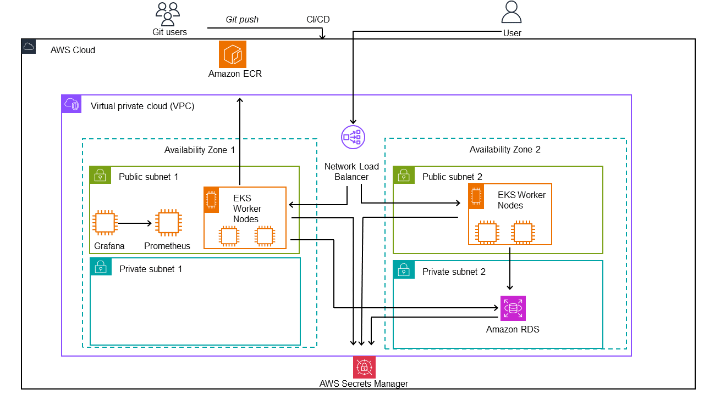

# Fintech DevOps Project: A Journey from Development to Deployment

For more details, check out my blog post : [https://thelearningjourney.co/](https://thelearningjourney.co/automating-the-cloud-the-evolution-of-a-python-app-with-docker-kubernetes-and-terraform/)

## Application Description


The Financial (Fintech) Cloud Project presents a mock financial technology application. The application features a RESTful API developed with Python.
For the infrastructure, we use AWS, Terraform, Ansible, and Python.

### Core Features

- **User Management**: Secure registration and authentication system.
- **Account Handling**: Creation and management of user financial accounts.
- **Transaction Processing**: Facility to perform and track financial transactions.

### Development and Deployment Journey

This project encapsulates the full software development lifecycle, starting with a basic mock application and culminating in a cloud-hosted solution.

1. **Local Development**: Initially, the application is developed locally, focusing on Flask for backend operations and integrating database management for user and transaction data.

2. **Dockerization**: The application is then containerized using Docker, demonstrating how Docker aids in maintaining consistency across various environments and simplifies the deployment process.

3. **Cloud Deployment on AWS**: Transitioning to AWS, the project employs services like EKS for Kubernetes orchestration and RDS for database management, AWS secrets, ECS and other services.

4. **Infrastructure as Code (IaC) and Ansible** :  Utilizing Terraform and Ansible, the project highlights the advantages of IaC in automating and replicating infrastructure setups efficiently.

5. **CI/CD**: Implement GitHub CI/CD pipelines to automate testing and deployment, ensuring faster delivery .

### Architecture Overview

- **Frontend**: Flask-based web application.
- **Backend**: AWS services such as EKS or AWS RDS (PostgreSQL).
- **Infrastructure**: Managed using Terraform and Ansible.
- **CI/CD**: GitHub Actions for automated workflows.
- **Monitoring**: Prometheus and Grafana.

## Prerequisites

- AWS Account
- Terraform
- Kubernetes (kubectl)
- Docker
- AWS CLI (configured)
- Pyenv (optional, for Python version management)

## Deploying the Infrastructure

1. **Infrastructure Setup with Terraform**:
In the folder *terraform*
   - Ensure a Terraform backend is set up with an S3 bucket and DynamoDB table.
   - Modify `backend.tf` to match your AWS configuration.
   - Could use 2 nodes in the `terraform.tfvars` file to have High Availability (HA) to run the mock app.
   - Run the following commands in the `terraform` directory:

     ```
     cd terraform
     terraform init
     terraform apply
     ```

2. **Kubernetes Configuration**:
In the folder *k8s*
   - Use the `terraform output` *configure_kubectl* to update your context.
   - Run the provided command to configure kubectl for your EKS cluster.
   - Give the rights to execute the `wrapper-rds-k8s.sh` script in the `k8s`folder

     ````
     chmod +x ./wrapper-rds-k8s.sh`
     ````

   - Run the script

     ````
      sudo ./wrapper-rds-k8s.sh
     ````

   -
     Apply for the Ingress controller:

     ```
     kubectl apply -f https://raw.githubusercontent.com/kubernetes/ingress-nginx/controller-v1.8.2/deploy/static/provider/aws/deploy.yaml
     ```

   - Wait for the Ingress controller to be fully deployed.
   - Apply the Kubernetes manifests from the `k8s` directory:

     ```
     kubectl apply -f k8s/
     ```

3. **Accessing the Application**:
   - Use `kubectl get ingress` and wait for the address to appear to access the application.

4. **Monitoring Setup**:
   - Go in the `ansible` folder.
   - run the script `python3 update_inventory.py` to update the inventory.
   - launch `ansible-playbook playbook.yml -vv` to configure Prometheus and Grafana
   - run `python3 generate_grafana_api_key.py` to generate a grafana api key and store it on AWS Secrets Manager
   - run `python3 add_grafana_dashboard.py` to create a basic dashboard on Grafana.

To access Prometheus you will use in your browser `<PROMETHEUS_PUBLIC_IP>:9090`, and for Grafana you will paste in your browser  `<GRAFANA_PUBLIC_IP>:3000` .
These information can be found in the `inventory.yml` file .
Default user and password for Grafana is `admin` .

## Local Development and Testing

For local development and testing, the Fintech Cloud Project can be run using Docker Compose.

### Requirements for Local Testing

- Docker and Docker Compose installed on your machine.
- Local clone of the repository.

### Setting Up the Local Environment

1. **Configure Environment Variables**:
   - Create a `.env` file in the `src` directory.
   - Define the necessary environment variables. For example:

     ```
     SECRET_KEY=your_secret_key
     POSTGRES_DB=mydatabase
     POSTGRES_USER=myuser
     POSTGRES_PASSWORD=mypass
     ```

2. **Docker Compose Setup**:

   - The `docker-compose.yml` file define the services needed for the application, such as the web server and the PostgreSQL database.
   - Make sure the PostgreSQL service environment match the value in the *.env* file.

3. **Build and Run with Docker Compose**:
   - In the root directory of the project, run the following command to build and start the containers:

     ```
     docker-compose up --build
     ```

   - This command builds the Docker image for the web application and starts all the services defined in the `docker-compose.yml`.

4. **Waiting for Database Readiness**:
   - The script (e.g., `wait-for-postgres.sh`) in the web application container goal is to wait for the PostgreSQL service to be ready before starting the Flask application.
   - This script should attempt to connect to the PostgreSQL database and only proceed once a successful connection is established.

5. **Accessing the Application**:
   - Once the containers are up and running, the web application should be accessible at `http://localhost:5000` or the configured port.

### Cleanup

- To stop and remove the containers, along with their network, use the following command:

```
docker-compose down
````
